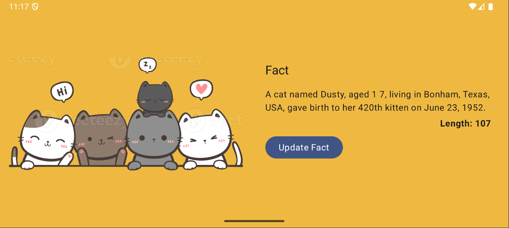
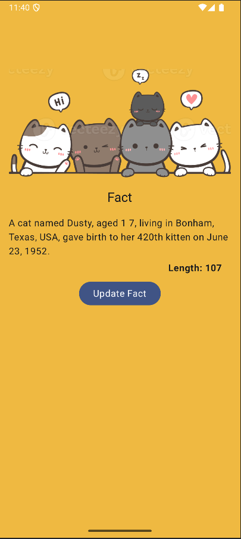

# Cat Facts App

## Overview
Cat Facts App is a simple Android application that provides users with random, interesting facts about cats. Built with a simple design and implementing modern Android development practices.

## Feature
- **Get Random Cat Facts**: Fetch random cat facts from a public API.
- **Share Facts**: Share your favorite cat facts with friends via social media or messaging apps. [in progress..]
- **Save Favorites**: Mark facts as favorites to view them later. [in progress..]

## Tech Stack
- **Programming Language**: Kotlin
- **Architecture**: MVVM (Model-View-ViewModel)
- **UI Components**: Jetpack Compose
- **Networking**: Retrofit with Coroutines
- **Dependency Injection**: Hilt
- **Local Storage**: DataStore
- **Testing**: JUnit and Robolectric
- **Architecture**: Multi module

## Installation
### Prerequisites
- Android Studio
- Android device or emulator running Android 8.0 (API level 26) or higher

### Steps
1. Clone this repository
2. Open the project in Android Studio.
3. Sync the Gradle files.
4. Build and run the app on an emulator or physical device.

## API Integration
The app fetches cat facts from the [Cat Facts API](https://catfact.ninja/). Ensure you have internet access while using the app.

## App Architecture
The application follows the MVVM architecture pattern for better separation of concerns:
- **App**: Contains App, MainActivity, and App setting.
- **Libs**: Lib module that used by feature module. Each library has its own function.
- **Feature**: Features splits into modules.

## UI Architecture
- **Model**: Manages data handling and business logic. Uses DataStore for local storage and Retrofit for remote data fetching.
- **View**: Composes the UI using Jetpack Compose components.
- **ViewModel**: Acts as a bridge between the Model and View, StateFlow for UI observation.

## Folder Structure for App
```
project/
├── app/             # application
├── build-src/       # pre-compile dependency for library and feature module
├── config/          # config for detekt
├── docs/            # for documentation purpose
├── features/        # contains feature modules
└── libs/            # contains lib modules
```

## General Folder Structure for Feature
```
feature/
├── api/             # api endpoint interface for retrofit
├── data/            # data model for retrofit response
├── datasource/      # data source for repository, local and remote data source
├── di/              # dependency injection setup using Hilt
├── repository/      # repository for view model to get the data
├── ui/              # UI components, screens, view model seprated by screen directory
├── utils/           # Utility classes and extensions
└── tests/           # Unit and UI tests
```

## Screenshots



## Contact
For inquiries or feedback, feel free to reach out:
- Email: liantriana.beny@gmail.com
- GitHub: [benyliantriana](https://github.com/benyliantriana)
